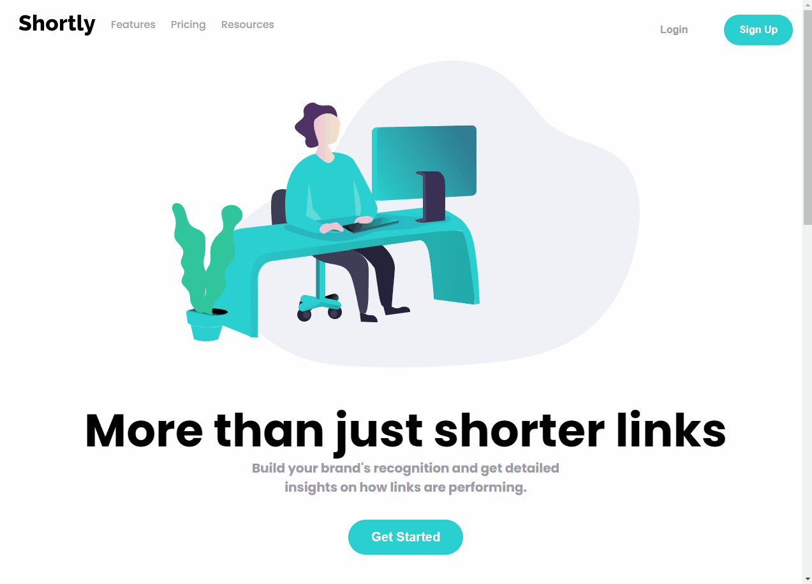

# URL Short

## Descrição

Esse Projeto é um desafio da [Frontend Mentor](https://www.frontendmentor.io/challenges/url-shortening-api-landing-page-2ce3ob-G) que consiste em usar [shrtcode API](https://shrtco.de/) para encurtar um URL inserido pelo usuário.

 

## Tecnologias

 

#### - Chakra-UI

 

    
        
      
    
    
  

---

   

## Instalação

 

### Primeiro clone o repositório abaixo.

 

    https://github.com/matheuskarnas/url-short.git

### Após clonado vamos instalar as dependências, vá até repositório que você acabou de clonar e rode:

 

    yarn
     #
    npm

### Agora com as dependências instaladas, vamos rodar o projeto executando:

 

    yarn dev
        #
    npm dev

se tudo for feito corretamente o projeto deve estar rodando [aqui](http://localhost:3000/).

---

 

## Contato

 

Gostou do projeto, tem alguma dúvida ou sugestão não deixe de me contatar.

 

<a  href="https://www.linkedin.com/in/matheuskarnas/">
     
<a/>
<a  href="mailto:matheuskarnas1@gmail.com">
     
<a/>

---
